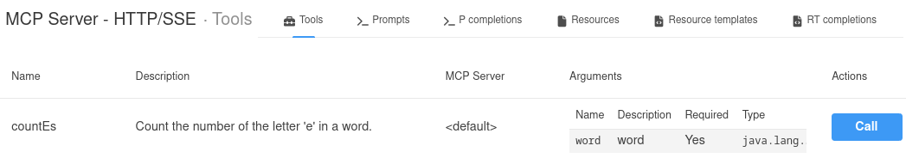
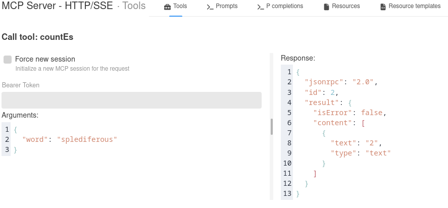
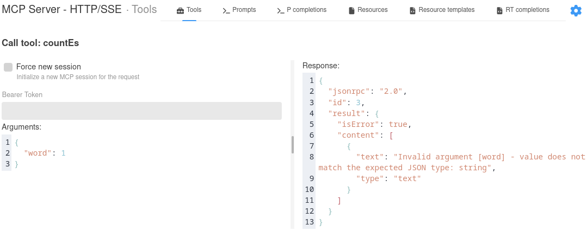
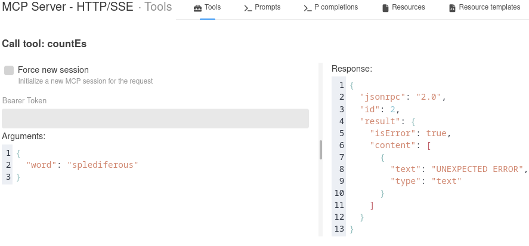

# Demo of Camel + Quarkus MCP

An example for integrating existing Apache Camel routes with Quarkus MCP, making them available to external AI agent clients. 

## Purpose 

Development teams are being asked to incorporate AI into production systems, but may not know where to begin. This demo shows one way to make an existing Camel Quarkus route available to new AI agents, without requiring any changes to the route.

Future work will show how to do the same with Spring AI for existing Camel Spring Boot applications and a more complex example for a secured and limited access MCP endpoint.

## Walkthrough

Large Language Models (LLMs) on their own are incapable of executing your complex business logic or interacting with external applications, databases, messages brokers, and so on. 
They can't even count the number of specific letters in a word.

For example, here we can see [granite4:1b](https://www.ibm.com/granite/docs/models/granite) running on [Ollama](https://ollama.com/) confidently hallucinate four letter 'e's in the word "splendiferous".

```
❯ ollama run granite4:1b
>>> How many 'e's are in the word splendiferous?
The word "splendiferous" contains 4 'e' letters.
```

### `mcp-service`

Fortunately, we have an existing Apache Camel route that can accurately count letter 'e's in any word.

```java
@ApplicationScoped
public class CountEsRoute extends RouteBuilder {

    @Override
    public void configure() throws Exception {

        restConfiguration().inlineRoutes(false);

        rest("/camel/countEs")
            .post()
                .to("direct:countEs");

        from("direct:countEs")
            .routeId("countEs")
            .log("word=${body}")
            .process(exchange -> {
                String body = exchange.getIn().getBody(String.class);
                String result = Long.toString(List.of(body.split("")).stream()
                    .filter(s -> s.equalsIgnoreCase("e"))
                    .count());
                exchange.getIn().setBody(result);
            })
            .log("count=${body}");
    }
}
```

It has a [REST DSL](https://camel.apache.org/manual/rest-dsl.html) interface, so we can call it with `curl` as

```sh
curl -X POST localhost:8080/camel/countEs -H "Content-Type: text/plain"  -d "Splendiferous"
```

and get 
```sh
2
```
for the correct answer.

We will make the `countEs` route available as an [Quarkus MCP Server](https://docs.quarkiverse.io/quarkus-mcp-server/dev/index.html) endpoint. 

*Note: to reuse a REST DSL route's `direct` endpoint, we must have `restConfiguration().inlineRoutes(false)` (or set `camel.rest.inline-routes = true` in an `application.properties` file) so that it is not automatically swallowed into the `rest()` route and is accessable outside of it.*

To add a Quarkus MCP Server to our application, we just need to include the extension `io.quarkiverse.mcp:quarkus-mcp-server-http` and use some of its annotations. Here we create a new class `CountEsTool` with a method `countEs(String word)`. 
We annotate the method with `@Tool` to make it an MCP tool with the provided name and description, and annotate its parameter with `@ToolArg`.
These will be reported to an AI agent when it requests a list of available tools from the MCP server. The agent will infer from prompts which tool should be used and with what arguements.

To pass the data into the `countEs` route, we simply `@Inject` a `ProducerTemplate` into the class and use `requestBody()` to send a message into the route. 
This method throws a `CamelExecutionException`, so we set the method return type to `ToolResponse` instead of just `String` to clearly indicate any errors from route execution to the agent with `ToolResponse.error()` and the happy path response with `ToolResponse.success()`.

```java 
public class CountEsTool {

    @Inject
    ProducerTemplate producer;

    @Tool(name = "countEs", description = "Count the number of the letter 'e' in a word.")
    ToolResponse countEs(@ToolArg(description = "word") String word) {
        Log.info("MCP request to count 'e's in "+word);
        try {
            String response = producer.requestBody("direct:countEs", word, String.class);
            return ToolResponse.success(response);
        } catch (CamelExecutionException e) {
            Log.error(e);
            e.printStackTrace();
            return ToolResponse.error(e.getMessage());
        }
    }
}
```

That's all we need to create the MCP server! We can manually test it by running the Quarkus service in Dev mode
```
mvn -f mcp-service/pom.xml quarkus:dev
```
and opening the MCP Server Tools page in the Dev UI console at http://localhost:8080/q/dev-ui/quarkus-mcp-server-http/tools. 
We can see an entry for the `countEs` tool.



When we call it with `splendiferous`, we get the correct response.




When we provide the wrong argument or type, we get an error response from the MCP Server. Note `isError: true`.



And if we modify the route to throw an error, we see it pass up just the error message for a response with `isError: true`.
```java
from("direct:countEs")
    .routeId("countEs")
    .log("word=${body}")
    .throwException(new CamelExecutionException("UNEXPECTED ERROR", null) {})
    .process(exchange -> {
    ...
```



We can also unit test it with the extension `io.quarkiverse.mcp:quarkus-mcp-server-test` which provides the [McpAssured](https://docs.quarkiverse.io/quarkus-mcp-server/dev/guides-testing.html) library. See the link for many more detailed examples. Here we have a test for the happy path and if the wrong type of argument is provided.

```java
@QuarkusTest
class CountEsMcpToolTest {

    @Test
    void happyPath() {
        McpSseTestClient client = McpAssured.newConnectedSseClient();
        client.when()
            .toolsCall("countEs",
                Map.of("word", "splendiferous"),
                response -> {
                    assertFalse(response.isError());
                    TextContent text = response.content().getFirst().asText();
                    assertTrue(text.text().contains("2"));
            })
            .thenAssertResults();
        client.disconnect(); 
    }

    @Test
    void wrongArgument() {
        McpSseTestClient client = McpAssured.newConnectedSseClient();
        client.when()
            .toolsCall("countEs",
                Map.of("word", 1),
                response -> {
                    assertTrue(response.isError());
            })
            .thenAssertResults();
        client.disconnect(); 
    }
}
```

### `mcp-client`

Now that we have our Camel route wrapped with an MCP Server, let's try it out with a real AI agent. 

For this, we just need to create a new Quarkus project with the extensions `io.quarkiverse.langchain4j:quarkus-langchain4j-mcp` and, for local development, `io.quarkiverse.langchain4j:quarkus-langchain4j-ollama`, as well as `io.quarkus:quarkus-rest-jackson` to provide a REST interface for the client.

We start with creating the agent as a service interface annotated with the Quarkus LangChain4j annotation `@RegisterAiService`. It has a method annotated with `@McpToolBox` to give it access to any MCP servers configured and `@SystemMessage` and `@UserMessage` annotations to prompt the agent with.

```java
@RegisterAiService
public interface AiLetterCounterService {
   @SystemMessage("""
        Count the number of letter 'e's in the provided word.
        Limit your response just the number. 
    """)
    @McpToolBox
    public String countEs(@UserMessage String word);
}
```

In the `application.properties` file, we configure the Quarkus LangChain4j extension to use a `granite4:1b` model served locally by an Ollama instance started automatically as a Dev Services container. 
There will be a pause the first time we run the application for it to download and serve the model.
We also declare an MCP server named `countes` that uses `streamable-http` for its `transport-type` and is reachable locally at `http://localhost:8080/mcp/`.
Of course, we must set a value for the HTTP port so it doesn't conflict with our `mcp-service` application.

```ini
quarkus.langchain4j.chat-model.provider=ollama
quarkus.langchain4j.ollama.chat-model.model-id=granite4:1b

quarkus.langchain4j.mcp.countes.transport-type=streamable-http
quarkus.langchain4j.mcp.countes.url=http://localhost:8080/mcp/

quarkus.http.port=8081
```

To drive the AI agent interaction, we provide a `CountEsResource` with the `AiLetterCounterService` `@Inject`ed in.

```java
@Path("/countEs")
public class CountEsResource {

    @Inject AiLetterCounterService aiLetterCounterService;

    @GET
    @Path("/{word}")
    @Produces(MediaType.TEXT_PLAIN)
    public String ask(@PathParam("word") String word) {
        Log.infof("Counting 'e's in %s", word);
        String result = aiLetterCounterService.countEs(word);
        Log.infof("Result=%s", result);
        return result;
    }
}
```

Finally, we give all the wheels a spin by running the client
```
mvn -f mcp-client/pom.xml quarkus:dev
```

And calling its REST endpoint.
```
curl localhost:8081/countEs/splendiferous
```

We can see in `mcp-client` logs that it invoked the AI agent
```logs
2026-02-24 16:29:48,754 INFO  [com.redhat.consulting.integration.camel.quarkus.mcp.CountEsResource] (executor-thread-1) Counting 'e's in splendiferous
2026-02-24 16:29:52,168 INFO  [com.redhat.consulting.integration.camel.quarkus.mcp.CountEsResource] (executor-thread-1) Result=There are 2 letter 'e's in the word splendiferous.
```
and in the `mcp-service` logs that the original Camel route executed.
```
2026-02-24 16:29:50,571 INFO  [com.redhat.consulting.integration.mcpservice.CountEsRoute:23] (vert.x-worker-thread-1) word=splendiferous
2026-02-24 16:29:50,571 INFO  [com.redhat.consulting.integration.mcpservice.CountEsRoute:31] (vert.x-worker-thread-1) count=2

```


## Quick Demo Steps

### Start `mcp-service`

```
cd mcp-service
mvn quarkus:dev
```

### Test `mcp-service`

#### REST DSL endpoint

And in another terminal
```
❯ curl -X POST localhost:8080/camel/countEs -H "Content-Type: text/plain"  -d "Splendiferous"
2
```

#### MCP Endpoint

Visit the Dev UI page: http://localhost:8080/q/dev-ui/quarkus-mcp-server-http/tools

### Test `mcp-client`

In a new terminal session,
```
cd mcp-client
mvn quarkus:dev
```

And in yet another new terminal:
```
❯ curl localhost:8081/countEs/splendiferous
There are 2 letter 'e's in the word splendiferous.
```
